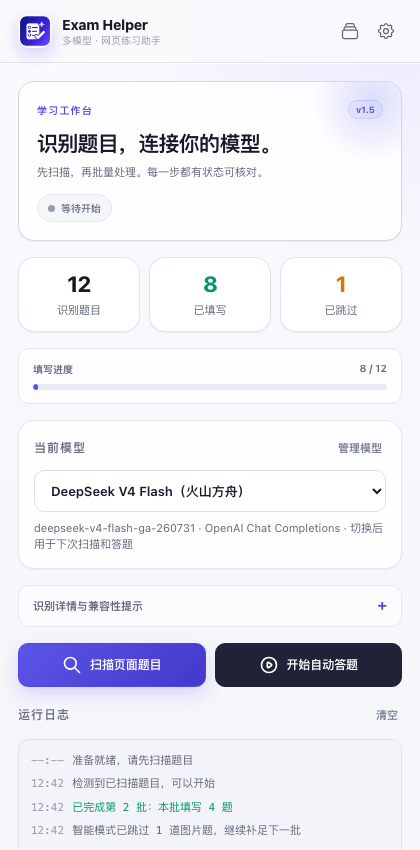
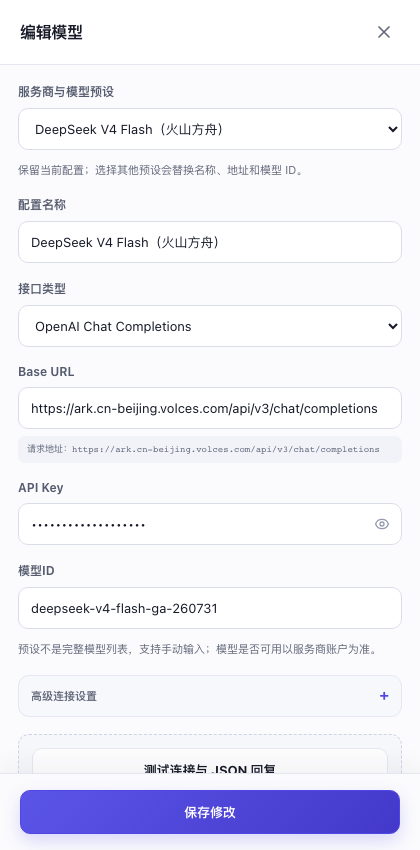
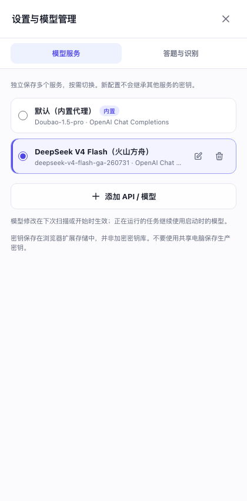
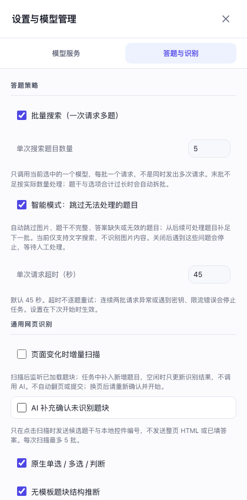

# Exam Helper

  

  面向 Chrome / Edge 的多模型网页练习助手：通用题目识别、批量调用、答案填写核验与可扩展站点模板。

> 仅用于获准的练习、教学与测试场景。扩展不会自动提交页面，AI 生成的答案仍需人工核对。

## 界面预览

### 学习工作台

### 多服务 API 配置

### 模型管理

### 批量答题与识别策略

## 主要功能

- 通用网页识别：综合语义结构、表单控件、ARIA、站点模板与启发式策略识别题目。
- 多题单请求：按可配置批量大小，将多道题合并为一次 AI 请求，降低请求次数与等待时间。
- 智能跳过：图片题、题干不完整或当前无法处理的题目不会占用批次名额，可继续补足后续题目。
- 动态页面适配：支持增量扫描、开放 Shadow DOM 与同源 iframe；页面变化后重新校验目标控件。
- 多题型填写：覆盖单选、多选、判断、文本输入、下拉选择等常见形式。
- 模板扩展：内置 Canvas、Google Forms、江南大学实验室、Moodle、Open edX、SurveyJS、腾讯问卷和问卷星模板，也支持导入自定义 JSON 模板。
- 安全边界：不自动翻页、不自动提交；API Key 不写入源码或日志，远程服务强制使用 HTTPS。

## 支持的 API

| 接口协议 | 内置示例 |
| --- | --- |
| OpenAI Chat Completions | OpenAI、DeepSeek、通义千问、Kimi、GLM、SiliconFlow、OpenRouter、Ollama、LM Studio、火山方舟 DeepSeek |
| OpenAI Responses | OpenAI、火山方舟豆包 |
| Anthropic Messages | Claude |
| Gemini `generateContent` | Google Gemini |

预设中的模型 ID 只是可编辑示例，实际可用模型、权限与价格以服务商控制台为准。接口细节与安全说明见 [API_PROVIDERS.md](API_PROVIDERS.md)。

## 安装

1. 下载或克隆本仓库。
2. 打开 Chrome 的 `chrome://extensions/`，或 Edge 的 `edge://extensions/`。
3. 开启“开发者模式”。
4. 选择“加载已解压的扩展程序”，并选择项目根目录。
5. 打开需要处理的练习页面，从浏览器工具栏启动 Exam Helper。

## 使用

1. 在“模型服务”中添加 API 配置并测试连接。
2. 在“答题与识别”中设置单批题目数量、智能模式和识别策略。
3. 点击“扫描页面题目”，核对识别数量与兼容性提示。
4. 点击“开始自动答题”，完成后人工检查页面内容再决定是否提交。

## 已知限制

- 当前不做图片 OCR 或视觉理解；纯图片题会在智能模式下跳过。
- 跨域 iframe、封闭 Shadow DOM、拖拽、排序、连线及复杂富文本题可能需要人工处理或自定义模板。
- 网页结构和模型接口可能随时变化，遇到新站点时建议先小批量扫描和验证。

## 测试

项目包含 AI 客户端、批处理引擎、模型选择、通用 DOM、模板库与后台请求的回归测试。当前版本通过 **98 项测试**。

## 隐私与安全

- 只有开始分析后，题目内容才会发送到你主动选择的模型服务。
- 连接测试只发送固定探针，不包含网页题目，但可能产生少量服务商费用。
- API Key 保存在浏览器扩展本地存储中，不是加密密钥库；不要在共享设备上保存生产密钥。
- 请勿把个人密钥提交到 Git 仓库、Issue 或截图中。

## 作者

**[sinpoce](https://github.com/sinpoce)**

## 许可证

本项目采用 [GNU General Public License v3.0](LICENSE)。
